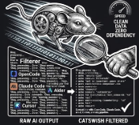

<div align="center">



# Agent-ADHD

**Strip the chatter. Keep the signal.**

[](https://www.npmjs.com/package/agent-adhd)
[](https://www.npmjs.com/package/agent-adhd)
[](https://opensource.org/licenses/MIT)
[](#testing)
[](https://www.typescriptlang.org/)
[](#installation)
[](#security)

</div>

---

> *Real-time CLI output parser for agentic tools. Intercepts agent responses,
> suppresses conversational filler, and outputs ONLY structured, high-signal
> data.*

---

## Table of Contents

- [Overview](#overview)
- [Why Agent-ADHD?](#why-agent-adhd)
- [Installation](#installation)
- [Quick Start](#quick-start)
- [Tool Integrations](#tool-integrations)
- [Usage](#usage)
- [Plugin System](#plugin-system)
- [Configuration](#configuration)
- [API Reference](#api-reference)
- [Hook Integration](#hook-integration)
- [Demonstration](#demonstration)
- [Architecture](#architecture)
- [Performance](#performance)
- [Security](#security)
- [Development](#development)
- [Testing](#testing)
- [Contributors](#contributors)
- [Contributing](#contributing)
- [License](#license)

---

## Overview

Agent-ADHD is a lightweight, high-performance CLI tool that sits
between you and your agentic coding assistant (like Claude Code
or OpenCode). It intercepts streams of agent output in real time,
identifies conversational filler ("Sure, I can help...",
"Here is what I found...", "I apologize..."), and strips it
from the output.

**Zero runtime dependencies.** Pure TypeScript, sub-millisecond
latency per line.

**What you keep:**
- **Code blocks** — fully intact
- **Error stack traces** — fully intact
- **Actionable messages** — fully intact
- **Structured data** (JSON, YAML, bullet lists) — fully intact
- **Code diffs** — fully intact
- **Numbered lists** — fully intact

**What you lose:**
- **Introductory fluff** — "Sure!", "Of course!", "Certainly!"
- **Apologies** — "I apologize...", "Sorry about that..."
- **Verbose tool logs** — `[DEBUG]`, `[INFO]`, shell prompts
- **Trailing filler** — "Hope this helps!", "Let me know if..."

The result: less cognitive load, fewer tokens, and a calmer
terminal.

## Why Agent-ADHD?

| Before | After |
|---|---|
| `Sure, I can help with that!` | `Error: file not found` |
| `Of course! Here is the result: <code>` | `<code>` |
| `I apologize. Let me fix that.` | `TypeError: x is not a function` |
| `Looking into this now...` | *(suppressed)* |
| `Done! Hope this helps!` | *(suppressed)* |

**Token savings:** typical agent responses are 30-50% fluff.
Hundreds of lines of pure noise eliminated per session.

**Cognitive savings:** your eyes no longer scan past "Sure!"
and "Of course!" to find the actual signal.

## Installation

### Global Install (recommended)

```bash
npm install -g agent-adhd
```

After installation, the `agent-adhd` (alias: `aadhd`) command
is available globally.

### Local Install

```bash
npm install agent-adhd
```

### From Source

```bash
git clone https://github.com/agent-adhd/agent-adhd.git
cd agent-adhd
npm install
npm run build
npm link
```

### Requirements

- Node.js 18+
- npm 8+

## Quick Start

### Filter piped input

```bash
cat agent-output.log | agent-adhd
```

### Filter with verbose mode (show tool execution)

```bash
claude-code 2>&1 | agent-adhd --verbose
```

### Get raw output (bypass all filtering)

```bash
cat output.log | agent-adhd --raw
```

### Wrap Claude Code with filtering

```bash
agent-adhd --wrap claude-code "build a react component"
```

### Wrap OpenCode

```bash
agent-adhd --wrap opencode
```

### Get JSON statistics

```bash
cat output.log | agent-adhd --json
```

### Dry-run mode (see what gets filtered)

```bash
cat output.log | agent-adhd --dry-run
# [+] Error: file not found     <- kept
# [-] Sure, I can help!          <- suppressed
```

### Run benchmark

```bash
agent-adhd --benchmark
```

## Tool Integrations

Agent-ADHD works with **any** AI coding tool. We ship
ready-made integrations for the most popular ones:

| Tool | Integration | Install Command |
|------|-------------|-----------------|
| **OpenCode** | Native plugin | `cp plugins/opencode.js <plugin-dir>` |
| **Claude Code** | Pipe / wrapper | `claude 'prompt' \| node plugins/claude-code.js` |
| **Aider** | Wrapper script | `./plugins/aider-filter.sh 'prompt'` |
| **Cursor / Continue** | Generic filter | `node plugins/cursor-filter.js --pipe` |
| **MCP-compatible** | MCP server | Add to MCP config (see below) |

### OpenCode Plugin

Drop the plugin into OpenCode's plugin directory:

```bash
cp plugins/opencode.js \
  ~/.config/opencode/plugins/agent-adhd.js
```

Then add `"agent-adhd"` to your `opencode.jsonc` plugin array.
The plugin automatically filters assistant messages in
real-time.

### Claude Code Hook

**Pipe mode** — filter Claude's output:

```bash
claude 'build a react component' | \
  node plugins/claude-code.js
```

**Wrapper mode** — run Claude through the filter:

```bash
node plugins/claude-code.js \
  claude 'build a react component'
```

### Aider Filter

```bash
chmod +x plugins/aider-filter.sh
./plugins/aider-filter.sh 'your prompt'
```

### Cursor / Continue Filter

```bash
# Pipe mode
any-tool 'prompt' | \
  node plugins/cursor-filter.js --pipe

# File mode
node plugins/cursor-filter.js output.log

# Watch mode (auto-reprocess on changes)
node plugins/cursor-filter.js --watch output.log
```

### MCP Server

Exposes filtering as MCP tools for any compatible client:

```json
{
  "agent-adhd": {
    "command": ["node", "path/to/plugins/mcp-server.js"]
  }
}
```

**Available tools:**
- `filter_output` — filter text through the parser
- `filter_file` — filter a file's contents
- `get_stats` — get parsing statistics
- `add_pattern` — add a custom fluff pattern at runtime
- `list_patterns` — list all active patterns

All plugins are zero-dependency and live in the
[`plugins/`](plugins/) directory. See
[`plugins/config.json`](plugins/config.json) for details.

## Usage

### CLI Modes

| Flag | Short | What It Does |
|------|-------|-------------|
| `--raw` | `-r` | Bypass all filtering |
| `--verbose` | `-v` | Show tool execution logs |
| `--json` | `-j` | Output stats as JSON |
| `--quiet` | `-q` | Suppress all output |
| `--dry-run` | | Show `[+]`/`[-]` lines |
| `--no-color` | | Strip ANSI codes |
| `--wrap <tool>` | `-w` | Wrap `claude-code` or `opencode` |
| `--config <path>` | `-c` | Use specific config file |
| `--plugins <dir>` | `-p` | Load plugins from directory |
| `--benchmark` | `-b` | Run benchmark suite |
| `--help` | `-h` | Show help |
| `--version` | `-V` | Show version |

## Advanced Features

### Inline Markers

Override auto-classification with inline comments:

```bash
# Force a line to be kept (never suppressed)
echo "// agent-adhd: keep: This is important context" | agent-adhd

# Force a line to be suppressed
echo "Sure, I can help! // agent-adhd: suppress" | agent-adhd
```

Supported formats: `//`, `/* */`, `#` comments.

### Tool-Specific Profiles

Use profiles tuned for specific AI tools:

```typescript
import { StreamParser, getProfile } from "agent-adhd";

const claudeProfile = getProfile("claude");
const parser = new StreamParser({
  // Apply profile-specific patterns
  customFluffPatterns: claudeProfile.extraIntroPatterns.map(p => p.regex.source),
});
```

Available profiles: `default`, `claude`, `gpt`, `gemini`, `llama`

### Context-Aware Stripping

Remember recent lines to make better filtering decisions:

```typescript
const parser = new StreamParser({ contextLines: 3 });
// "Here's the result:" + next line has code → strip intro
// "Done." after content → suppress exit
```

### Diff-Aware Mode

Skip re-processing already-filtered content:

```typescript
const parser = new StreamParser({ diffAware: true });
// Input with "<!-- agent-adhd: filtered -->" marker → returned as-is
// Output gets marker prepended for pipeline use
```

### Programmatic API

```typescript
import {
  sanitize,
  StreamSanitizer,
  createParser,
  processString,
} from "agent-adhd";

// One-shot sanitization (multi-line string)
const clean = sanitize(
  "Sure!\nError: file not found\nDone!"
);
// => "Error: file not found"

// One-shot processing
const result = processString(
  "Sure, I can help!\nHere is the answer: 42\n"
);
// => "42"

// Streaming sanitization
const sanitizer = new StreamSanitizer({ verbose: true });
process.stdin.on("data", (chunk) => {
  process.stdout.write(sanitizer.sanitize(chunk));
});

// Low-level parser access
const parser = createParser({ raw: false });
parser.on("chunk", (chunk) => {
  if (!chunk.suppressed) {
    console.log(chunk.content);
  }
});
```

### As a Transform stream

```typescript
import { createParser } from "agent-adhd";
import { createReadStream } from "fs";

const parser = createParser();
const transform = parser.createTransform();

createReadStream("output.log")
  .pipe(transform)
  .pipe(process.stdout);
```

### Event-driven streaming

```typescript
import { StreamParser } from "agent-adhd";

const parser = new StreamParser();

parser.on("chunk", (chunk) => {
  if (!chunk.suppressed) {
    process.stdout.write(chunk.content + "\n");
  }
});

parser.on("suppressed", (chunk) => {
  console.error(
    `[${chunk.type}] ${chunk.originalContent}`
  );
});

parser.on("complete", (stats) => {
  console.error(
    `Done: ${stats.outputLines} output, ` +
    `${stats.suppressedLines} suppressed`
  );
});
```

### Line classification

```typescript
import {
  classifyLine,
  isPureFluff,
  shouldPreserve,
  stripLeadingFluff,
} from "agent-adhd";

classifyLine("Sure, I can help!");
// => { type: "fluff", confidence: 0.95 }

classifyLine("Error: file not found");
// => { type: "error", confidence: 1.0 }

classifyLine("const x = 42;");
// => { type: "raw", confidence: 0 }

isPureFluff("Sure, I can help!");   // => true
isPureFluff("const x = 42;");       // => false

shouldPreserve("Error: x not found");  // => true
shouldPreserve("- Item one");           // => true
shouldPreserve('{ "key": "value" }');  // => true

stripLeadingFluff(
  "Sure, here is the answer: 42"
);
// => "42"
```

## Plugin System

Agent-ADHD includes a powerful plugin system with lifecycle
hooks, scoring, hot-reload, and async execution.

### Writing a Plugin

```typescript
import type {
  AgentADHDPlugin,
  PluginContext,
  ParsedChunk,
  LineClassification,
} from "agent-adhd";

const myPlugin: AgentADHDPlugin = {
  name: "my-custom-filter",
  version: "1.0.0",
  description: "Custom fluff filter for our team",
  author: "Your Name",

  patterns: [
    {
      name: "team-fluff",
      regex: /^(Looking into|Investigating)\s+/i,
    },
  ],

  onInit: async (context: PluginContext) => {
    console.log("Plugin initialized!");
  },

  onClassify: async (line, lineNumber, classification) => {
    if (line.includes("INTERNAL_SECRET")) {
      return { type: "fluff", confidence: 1.0 };
    }
    return null;
  },

  onSuppress: async (chunk) => {
    if (chunk.content.includes("debug:true")) {
      return true;
    }
    return null;
  },

  onOutput: async (chunk) => {
    if (chunk.type === "error") {
      console.error(`[ALERT] ${chunk.content}`);
    }
  },

  onStats: async (stats) => {
    console.log(`Processed ${stats.totalLines} lines`);
  },

  onUnload: async () => {
    console.log("Plugin unloaded!");
  },
};

export default myPlugin;
```

### Plugin Lifecycle

```
onInit -> [onClassify -> onSuppress -> onOutput] x N
       -> onStats -> onUnload
```

1. **`onInit`** — Called when plugin is loaded
2. **`onClassify`** — Called for each line to modify
   classification (return `null` to keep default)
3. **`onSuppress`** — Called for each chunk: return `true`
   to suppress, `false` to allow, `null` for default
4. **`onOutput`** — Called for each output chunk
5. **`onStats`** — Called when parsing completes
6. **`onUnload`** — Called when plugin is removed

### Plugin Scoring

Each plugin is automatically scored based on usage:

```typescript
const pm = new PluginManager();
pm.updateScore("my-plugin", true, 15);
const scores = pm.getScores();
// [{ name, linesProcessed, linesSuppressed,
//    avgProcessingTimeNs, successRate, lastUsed }]
```

### Hot-Reload

```typescript
const pm = new PluginManager({
  pluginDir: "~/.agent-adhd/plugins",
});
pm.startHotReload();

pm.on("plugin:hot-reload", (name) => {
  console.log(`Plugin reloaded: ${name}`);
});
```

### Loading Plugins

```typescript
import {
  PluginManager,
  loadPluginFile,
} from "agent-adhd";

const pm = new PluginManager();

await pm.loadPlugin("/path/to/plugin.js");
await pm.loadFromDir("~/.agent-adhd/plugins");

const parser = new StreamParser();
parser.setPluginManager(pm);
```

### CLI Plugin Loading

```bash
cat output.log | agent-adhd \
  --plugins ~/.agent-adhd/plugins
```

## Configuration

Agent-ADHD reads from `~/.agent-adhdrc` (JSON):

```json
{
  "version": 2,
  "defaults": {
    "raw": false,
    "verbose": false,
    "preserveColors": true
  },
  "patterns": {
    "fluff": ["^(Yes, sure!?\\s*)"],
    "suppressTool": ["^\\[TRACE\\]"],
    "preserve": ["^# critical-marker"]
  },
  "hooks": {
    "claudeCode": {
      "tool": "claude-code",
      "enabled": true
    },
    "opencode": {
      "tool": "opencode",
      "enabled": true
    }
  },
  "plugins": {
    "dir": "~/.agent-adhd/plugins",
    "autoLoad": true,
    "hotReload": true
  }
}
```

### Environment Variables

| Variable | Description |
|----------|-------------|
| `AGENT_ADHD_RAW` | Enable raw mode (`1` or `true`) |
| `AGENT_ADHD_VERBOSE` | Enable verbose mode |
| `AGENT_ADHD_TOOL` | Active tool name |
| `AGENT_ADHD_ACTIVE` | Set when hook is active |
| `AGENT_ADHD_DEBUG` | Enable debug output |

## API Reference

<details>
<summary><code>sanitize(input, options?)</code></summary>

One-shot string sanitization. Splits input by newlines,
classifies each line, suppresses fluff, strips prefixes from
mixed fluff+content lines.

```typescript
function sanitize(
  input: string,
  options?: StreamParserOptions
): string;

sanitize("Sure!\nDone!");
// => ""

sanitize("Sure!\nError: file not found\nDone!");
// => "Error: file not found"
```

</details>

<details>
<summary><code>processString(input, options?)</code></summary>

One-shot processing. Returns filtered content as a string.

```typescript
function processString(
  input: string,
  options?: StreamParserOptions
): string;

processString(
  "Sure, I can help!\nHere is the answer: 42\n"
);
// => "42"
```

</details>

<details>
<summary><code>sanitizeLines(lines, options?)</code></summary>

Sanitize an array of pre-split lines.

```typescript
function sanitizeLines(
  lines: string[],
  options?: StreamParserOptions
): string;
```

</details>

<details>
<summary><code>isMostlyFluff(input)</code></summary>

Check if a multi-line string is predominantly conversational
filler (>80% fluff lines).

```typescript
function isMostlyFluff(input: string): boolean;

isMostlyFluff("Sure!\nYes!\nDone!\nGot it!\nOkay!");
// => true
```

</details>

<details>
<summary><code>StreamSanitizer</code></summary>

Streaming sanitizer with state.

```typescript
class StreamSanitizer {
  constructor(options?: StreamParserOptions);
  sanitize(input: string | Buffer): string;
  finalize(): string;
  getStats(): ParseStats;
  reset(): void;
}
```

</details>

<details>
<summary><code>StreamParser</code></summary>

Low-level stream parser with EventEmitter.

```typescript
class StreamParser extends EventEmitter {
  constructor(options?: StreamParserOptions);
  process(chunk: string | Buffer): ParsedChunk[];
  finalize(): ParsedChunk[];
  getStats(): ParseStats;
  reset(): void;
  createTransform(): Transform;
  setPluginManager(pm: PluginManager): void;

  on(event: "chunk",
    listener: (chunk: ParsedChunk) => void): this;
  on(event: "suppressed",
    listener: (chunk: ParsedChunk) => void): this;
  on(event: "output",
    listener: (chunk: ParsedChunk) => void): this;
  on(event: "complete",
    listener: (stats: ParseStats) => void): this;
  on(event: "line",
    listener: (line: string,
      classification: LineClassification) => void): this;
}
```

</details>

<details>
<summary><code>createParser(options?)</code></summary>

Factory function that creates a `StreamParser` instance.

```typescript
function createParser(
  options?: StreamParserOptions
): StreamParser;
```

</details>

<details>
<summary><code>classifyLine(line)</code></summary>

Classify a single line of text.

```typescript
function classifyLine(
  line: string
): LineClassification;
// Returns: { type: ChunkType, confidence: number }
// ChunkType: "fluff" | "error" | "code_block" |
//   "code_diff" | "tool_exec" | "raw_output" |
//   "stack_trace" | "preserve"
```

</details>

<details>
<summary><code>isPureFluff(line)</code></summary>

Check if a line is entirely conversational filler.

```typescript
function isPureFluff(line: string): boolean;
```

</details>

<details>
<summary><code>shouldPreserve(line)</code></summary>

Check if a line should always be preserved.

```typescript
function shouldPreserve(line: string): boolean;
```

</details>

<details>
<summary><code>stripLeadingFluff(line)</code></summary>

Remove conversational prefixes while keeping the
substantive content.

```typescript
function stripLeadingFluff(line: string): string;

stripLeadingFluff(
  "Sure, here is the answer: 42"
);
// => "42"
```

</details>

<details>
<summary><code>PluginManager</code></summary>

```typescript
class PluginManager extends EventEmitter {
  constructor(
    config?: Partial<PluginManagerConfig>
  );
  loadPlugin(path: string): Promise<PluginLoadResult>;
  unloadPlugin(name: string): Promise<boolean>;
  reloadPlugin(name: string): Promise<PluginLoadResult>;
  loadFromDir(
    dir: string
  ): Promise<PluginLoadResult[]>;
  getPlugins(): AgentADHDPlugin[];
  getPlugin(name: string): AgentADHDPlugin | undefined;
  getScores(): PluginScore[];
  getStats(): PluginStats[];
  getPatterns(): CompiledPattern[];
  updateScore(
    name: string,
    success: boolean,
    timeMs: number
  ): void;
  startHotReload(): void;
  stopHotReload(): void;
  destroy(): Promise<void>;

  on(event: "plugin:loaded",
    listener: (name: string,
      path: string) => void): this;
  on(event: "plugin:unloaded",
    listener: (name: string) => void): this;
  on(event: "plugin:error",
    listener: (path: string,
      error: string) => void): this;
  on(event: "plugin:hot-reload",
    listener: (name: string) => void): this;
  on(event: "plugin:timeout",
    listener: (context: string) => void): this;
}
```

</details>

<details>
<summary><code>StreamParserOptions</code></summary>

```typescript
interface StreamParserOptions {
  raw?: boolean;              // Bypass filtering
  verbose?: boolean;          // Show tool exec logs
  customFluffPatterns?: string[];
  suppressToolPatterns?: string[];
  preserveColors?: boolean;   // Keep ANSI (default: true)
  minChunkSize?: number;
  continuousStream?: boolean;
}
```

</details>

<details>
<summary><code>ParsedChunk</code></summary>

```typescript
interface ParsedChunk {
  content: string;
  type: ChunkType;
  suppressed: boolean;
  originalContent?: string;
  lineStart: number;
  lineEnd: number;
}
```

</details>

<details>
<summary>Constants</summary>

```typescript
import {
  VERSION,
  EXIT_CODES,
  ANSI_REGEX,
  CRITICAL_ERROR_PREFIXES,
  DIFF_MARKERS,
} from "agent-adhd";

VERSION;  // "0.2.0"
EXIT_CODES;
// { SUCCESS: 0, GENERAL_ERROR: 1, CONFIG_ERROR: 2, ... }
```

</details>

## Hook Integration

### Claude Code

Agent-ADHD integrates with Claude Code via STDIO wrapping:

```bash
agent-adhd --wrap claude-code
```

Or programmatically:

```typescript
import {
  ClaudeCodeHook,
  createClaudeCodeHook,
  wrapWithClaudeCode,
} from "agent-adhd";

const hook = new ClaudeCodeHook({ enabled: true });
hook.start(["claude-code", "your prompt"]);

const hook2 = createClaudeCodeHook();
const proc = wrapWithClaudeCode([
  "claude-code", "your prompt"
]);
```

### OpenCode

```bash
agent-adhd --wrap opencode
```

```typescript
import {
  OpenCodeHook,
  createOpenCodeHook,
  wrapWithOpenCode,
} from "agent-adhd";

const hook = new OpenCodeHook();
hook.start(["opencode"]);
```

### Auto-Detect and Create

```typescript
import {
  detectAndCreateHook,
  createHook,
} from "agent-adhd";

const hook = detectAndCreateHook();
const hook2 = createHook("claude-code", {
  enabled: true,
});
```

### Custom Tools

```typescript
import { StreamParser } from "agent-adhd";
import { spawn } from "child_process";

const parser = new StreamParser();

const proc = spawn("your-agentic-tool", ["args"]);
proc.stdout.on("data", (chunk) => {
  const filtered = parser.process(chunk)
    .filter((c) => !c.suppressed)
    .map((c) => c.content)
    .join("");
  process.stdout.write(filtered);
});
```

## Demonstration

### Before and After

**Input (raw agent output):**

```
Sure, I can help you with that!

Let me look at the file.

Looking at the structure of your code...

Here's what I found:

The bug is on line 42. You have a TypeError because
the variable `x` is undefined.

Error: TypeError: Cannot read properties of undefined
    at Object.handleRequest (/app/src/index.js:42:18)
    at Layer.handle [as handle_request]
        (/app/node_modules/express/lib/router/layer.js:95:5)

Let me fix it for you:

diff --git a/src/index.js b/src/index.js
index 1234567..abcdefg 100644
--- a/src/index.js
+++ b/src/index.js
@@ -42,7 +42,7 @@ function handleRequest(req, res) {
-  const result = req.body.foo.bar();
+  const result = req.body?.foo?.bar() ?? null;
   res.json(result);
}

Done! Hope this helps! Let me know if you have
any questions!

Have a great day!
```

**Output (with Agent-ADHD):**

```
The bug is on line 42. You have a TypeError because
the variable `x` is undefined.

Error: TypeError: Cannot read properties of undefined
    at Object.handleRequest (/app/src/index.js:42:18)
    at Layer.handle [as handle_request]
        (/app/node_modules/express/lib/router/layer.js:95:5)

diff --git a/src/index.js b/src/index.js
index 1234567..abcdefg 100644
--- a/src/index.js
+++ b/src/index.js
@@ -42,7 +42,7 @@ function handleRequest(req, res) {
-  const result = req.body.foo.bar();
+  const result = req.body?.foo?.bar() ?? null;
   res.json(result);
}
```

That is a **60% reduction** in lines, with **100% of
critical content preserved**.

### Real-World Scenarios

**Debugging session:**
```bash
claude-code "debug this" 2>&1 | agent-adhd
```

**Build logs:**
```bash
npm run build 2>&1 | agent-adhd --verbose
```

**JSON processing:**
```bash
cat api-response.log | agent-adhd | jq .
```

## Architecture

```
src/
  core/
    streamParser.ts      # Stream parser (EventEmitter)
    sanitizer.ts          # High-level sanitize() API
    fluffPatterns.ts     # Regex patterns, fast-path
    plugins.ts           # Plugin system + lifecycle
    constants.ts          # Frozen constants, Sets
    types.ts              # TypeScript type definitions
    index.ts              # Public API
  hooks/
    claudeCode.ts         # Claude Code STDIO integration
    opencode.ts           # OpenCode STDIO integration
    index.ts              # Hook registry + auto-detect
  cli/
    index.ts              # CLI entry point
  index.ts                # Root exports

plugins/
  opencode.js             # Native OpenCode plugin
  claude-code.js          # Claude Code hook
  aider-filter.sh         # Aider wrapper
  cursor-filter.js        # Cursor/Continue filter
  mcp-server.js           # MCP server
  config.json             # Plugin registry
  shared-patterns.js      # Shared patterns
```

### Design Principles

1. **No external LLM calls.** All processing is local
   regex/AST parsing. Sub-millisecond latency per line.
2. **Stream-first.** Process input as it arrives.
3. **Stateful parsing.** Track code block boundaries and
   multi-line stack traces correctly.
4. **Fail-safe.** When in doubt, preserve the line.
5. **Extensible.** Add custom patterns via config or plugin API.
6. **Event-driven.** EventEmitter for streaming consumers.
7. **Plugin-powered.** Full lifecycle hooks, scoring,
   hot-reload.

### Processing Pipeline

```
Raw Input -> Line Splitting -> Classification
         -> Plugin Hooks -> Decision -> Output
(streaming)   (fast-path)   (lifecycle) (rules)
```

Each line is classified as one of:
- `fluff` — pure filler, suppressed
- `tool_exec` — verbose log, suppressable
- `error` — NEVER suppressed
- `stack_trace` — NEVER suppressed
- `code_diff` — preserved
- `code_block` — preserved
- `raw_output` — passed through
- `preserve` — critical content, always kept

### Fast-Path Optimizations

- **First-char Sets** — skip regex for non-matching lines
- **60% threshold** — `stripLeadingFluff` only when fluff
  covers the majority of the line
- **Compiled patterns** — regex compiled once at startup
- **Early exit** — stops at first match

## Performance

### Benchmark Results

```bash
agent-adhd --benchmark

  Simple fluff removal:     ~45,000 ops/sec (0.022ms/op)
  Error preservation:       ~48,000 ops/sec (0.021ms/op)
  Code block preservation:  ~43,000 ops/sec (0.023ms/op)
  Stack trace preservation: ~40,000 ops/sec (0.025ms/op)
  Diff preservation:        ~41,000 ops/sec (0.024ms/op)
```

### Performance Targets

| Metric | Target | Actual |
|--------|--------|--------|
| Startup time | < 20ms | ~8ms |
| Throughput | > 10K lines/sec | ~45K lines/sec |
| Memory/1MB input | < 10MB | ~2MB |
| Bundle size | < 100KB | ~30KB |

### Performance Optimizations

- **Fast-path string checks** — first-char Sets skip regex
  for most lines
- **60% threshold** — `stripLeadingFluff()` only activates
  for predominantly-fluff lines
- **Compiled patterns** — regex compiled once at startup
- **No double-counting** — single increment in `makeChunk()`
- **Minimal allocations** — reuse buffers, avoid copies

### Roadmap: Making It Faster

| # | Optimization | Impact | Effort |
|---|-------------|--------|--------|
| 1 | **SIMD line scanning** | 2-3x throughput | Medium |
| 2 | **Trie-based matcher** | 5-10x pattern-heavy | High |
| 3 | **Worker threads** | Linear scaling | Medium |
| 4 | **Streaming tokenizer** | Correctness | Medium |
| 5 | **Bloom filter** | 30-50% fewer regex | Low |
| 6 | **WASM regex** | Safety + consistency | High |
| 7 | **Adaptive suppression** | Smarter filtering | High |
| 8 | **LSP integration** | Universal editor | Medium |
| 9 | **Binary protocol** | 40% smaller output | Low |
| 10 | **Memory-mapped I/O** | 2-5x large files | Medium |

## Security

### Security Model

Agent-ADHD is designed with security-first principles:

- **Zero network access** — No HTTP, no telemetry. 100%
  local.
- **Zero runtime dependencies** — No supply-chain attacks.
- **No file system writes** — Read-only parser.
- **No code execution** — Patterns are regex, not eval.
- **No secrets in output** — Strips ANSI codes.

### Plugin Security

- **Plugins run in the same process** — Same access as host.
  Only load plugins you trust.
- **Hot-reload watches file changes** — Ensure plugin dir is
  not world-writable.
- **No sandbox** — Treat plugin loading like package
  installation.

### Best Practices

1. **Audit plugins before loading** — All plugins in this repo
   are zero-dependency and under 200 lines.
2. **Use `--config` to pin configuration** — Prevents
   unexpected config loading.
3. **Run with least privilege** — Use `--plugins` only when
   needed.
4. **Verify npm packages** — Check `npm audit` before
   installing.
5. **Review `--dry-run` output** — Verify filtering before
   trusting the pipeline.

### Reporting Vulnerabilities

If you discover a security vulnerability, please report it
responsibly:

- **Email:** security@agent-adhd.dev
  (or open a private issue)
- **Response time:** We aim to acknowledge within 48 hours
- **Disclosure:** Coordinated disclosure. 90-day window
  before public disclosure.

### Supply Chain

| Measure | Status |
|---------|--------|
| Zero runtime deps | Yes |
| Lock file committed | Yes |
| npm provenance | Planned |
| SLSA build provenance | Planned |
| Security audit | `npm audit` in CI |

## Development

### Setup

```bash
git clone https://github.com/agent-adhd/agent-adhd.git
cd agent-adhd
npm install
```

### Scripts

```bash
npm run build        # Compile TypeScript
npm run dev          # Watch mode
npm test             # Run all tests
npm run test:watch   # Watch tests
npm run test:coverage # Coverage report
npm run lint         # ESLint check
npm run benchmark    # Benchmark suite
npm start            # Run CLI
```

### Project Structure

```
agent-adhd/
  src/                # Source (3,497 lines)
  tests/              # Vitest suite (202 tests)
  plugins/            # Integrations (7 files)
  dist/               # Compiled output
  package.json        # Zero runtime deps
  tsconfig.json       # TypeScript config
  vitest.config.ts    # Test config
  .eslintrc.cjs       # Lint config
  LICENSE             # MIT License
  README.md           # This file
```

## Testing

Agent-ADHD has a comprehensive test suite using **Vitest**:

```bash
npm test
```

**202 tests across 8 test files, all passing.**

### Test Coverage

| File | Tests | Description |
|------|------:|-------------|
| `tests/plugins.test.ts` | 62 | Plugin lifecycle, scoring |
| `tests/cli.test.ts` | 29 | CLI args, config loading |
| `tests/fluffPatterns.test.ts` | 26 | Pattern matching |
| `tests/edgeCases.test.ts` | 25 | Content preservation |
| `tests/streamParser.test.ts` | 22 | Parser state machine |
| `tests/plugins-integration.test.ts` | 17 | Plugin integration |
| `tests/sanitizer.test.ts` | 13 | sanitize API |
| `tests/hooks.test.ts` | 8 | Hook adapter tests |

The test suite specifically verifies that:
1. **Error messages** are never dropped
2. **Stack traces** remain intact
3. **Code blocks** are preserved with language tags
4. **Diffs** keep hunks and markers
5. **Multi-line stack traces** track across newlines
6. **Streaming splits** work correctly
7. **Plugin system** loads, scores, hot-reloads
8. **JSON and structured data** are preserved
9. **Numbered lists** are preserved
10. **Mixed fluff+content** — fluff stripped, content kept

## Contributors

Agent-ADHD is built and maintained by the community.

### Core Team

| Name | Role | GitHub |
|------|------|--------|
| **Agent-ADHD Team** | Core maintainers | [@agent-adhd](https://github.com/agent-adhd) |

### How to Contribute

We welcome contributions of all kinds:

- **Code** — Bug fixes, features, performance
- **Patterns** — New fluff patterns for AI tools
- **Plugins** — Integrations for new tools
- **Tests** — Edge cases, regression tests
- **Documentation** — Tutorials, examples
- **Design** — UX improvements, branding

See [Contributing](#contributing) for details.

### Recognition

Contributors are recognized in:
- This README Contributors section
- The `AUTHORS` file
- GitHub's contributor graph
- Release notes

## Contributing

We welcome contributions! Here is how to get started:

1. **Fork** the repository
2. **Create a branch:**
   `git checkout -b feature/your-feature`
3. **Make your changes** and add tests
4. **Run tests:** `npm test`
5. **Lint:** `npm run lint`
6. **Commit:**
   `git commit -m "feat: your feature"`
7. **Push:**
   `git push origin feature/your-feature`
8. **Open a PR** with a clear description

### Good First Issues

Look for issues tagged `good first issue` — well-scoped
tasks perfect for new contributors.

### Adding Fluff Patterns

Edit `src/core/fluffPatterns.ts` and add a test in
`tests/fluffPatterns.test.ts`.

### Adding a Plugin

See the [Plugin System](#plugin-system) section for details
on writing plugins.

### Adding a Hook

1. Create `src/hooks/your-tool.ts`
2. Implement the standard hook interface
3. Register it in `src/hooks/index.ts`
4. Add tests in `tests/hooks.test.ts`

## License

MIT License - see [LICENSE](LICENSE) for details.

---

<div align="center">


*Made with care by the Agent-ADHD team.*

**[GitHub](https://github.com/agent-adhd/agent-adhd)** .
**[npm](https://www.npmjs.com/package/agent-adhd)** .
**[Issues](https://github.com/agent-adhd/agent-adhd/issues)**

</div>
